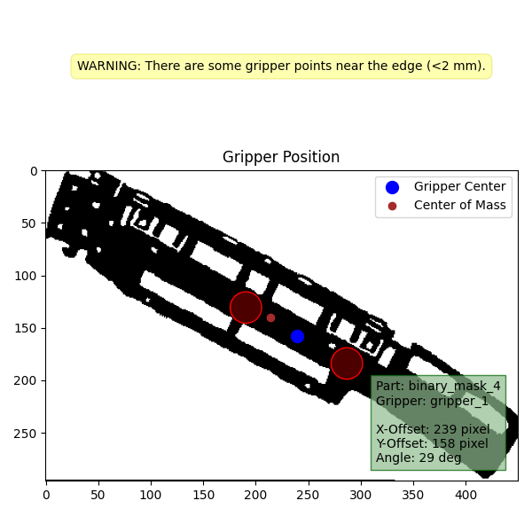
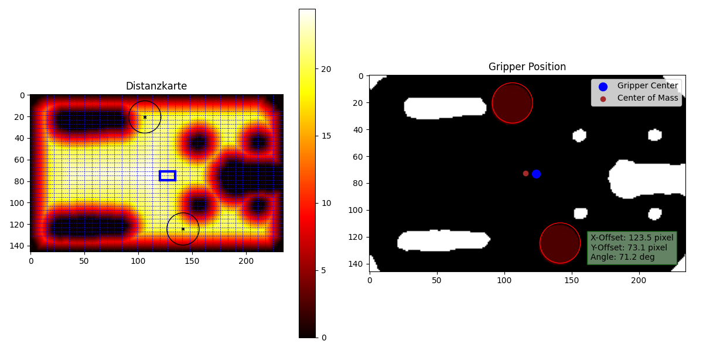
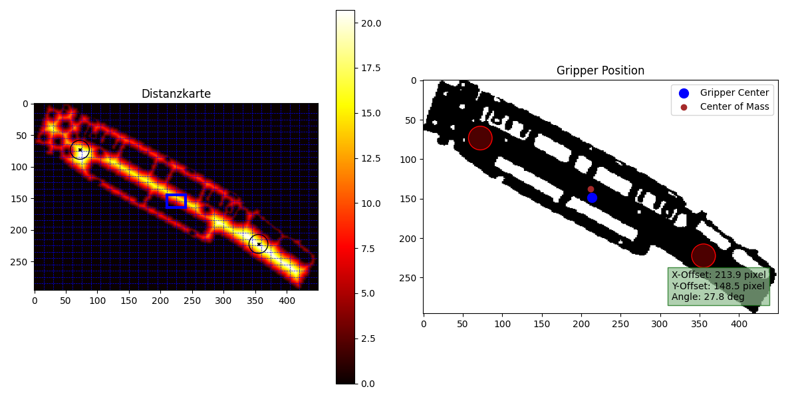

# Hackathon 2024 - Submission of Group *Zwischenlösung*

Team members: 

    - Johannes März 
    - Quentin Koplin 
    - Robert Maier 

## Description 

Im ersten Schritt der Lösung wird ein Machine-Vision-Ansatz angewendet, der ein Bild von einem Blechteil in ein Binärbild umwandelt. Dieser Ansatz basiert auf der Bildsegmentierung "Semantic Segmentation". Für die Architektur des Convolutional Neural Networks wurde U-Net gewählt. 

Die optimale Position des Greifers wird auf Basis des Greiferabstands von verbotenen Bereichen (wie Bohrungen und Ränder) und des Abstands der Greifermitte zum Bauteilschwerpunkt ermittelt. In diesem Scoring wird die Unterschreitung einer kritischen Randnähe von 3 mm besonders stark bestraft. Mittels dynamisch an die Bauteilabmaße angepasste Suchnetze wird in einem iterativen Prozess mit einer Coarse-Search, einer anschließenden Fine-Search und einer Decimal-Search die optimale Position auf Basis der ermittelten Scores gefunden. 

 

## How to Run 

1. CV-Modell "RMS_cv_model.pth" von der Drive "ProKI-Hackathon2024-Submissions" aus der Zip-Datei "Team-Zwischenloesung-CV-Modell" laden und in den Solution-Ordner legen.
2. Ausführen von `python solution/main.py path/to/input/tasks.csv output/solutions.csv` in der CMD.

## ✨ Besondere Funktionen unserer Lösung 

### Greifermittelpunkt (**Wichtig**)

Die Optimierung der Positionierung erfolgt zum **Bauteilschwerpunkt** und nicht dem Bildmittelpunkt. Diese Optimierung ist bewusst nicht auf die Aufgabenstellung ausgerichtet, sondern auf das reale Problem. Da der Schwerpunkt in unserer Lösung die tatsächliche physikalische Balance der vorhandenen Bauteilgeometrie berücksichtigt, werden präziseres und sicheres Greifen mit niedrigen Kippmomenten auf den Greifarm ermöglicht.  

### Zusätzliche Parameter zur Positionsoptimierung

Diese können verwendet werden, je nach Anforderung (Bspw Mindestabstand zum Rand), um die Positionierung des Greifers zu verbessern. Das ist möglich in der Funktion **main_get_position_and_visualization() in helper_positioning.py** 

- Randbereich (**min_distance_to_forbidden_area**): Definiert den Randbereich den der Greifer bestenfalls einhalten soll. Eine Positionierung in diesem Bereich wird in der Positionssuche nicht ausgeschlossen, aber durch stärkere Bestrafung vermieden, wenn möglich. Der Abstand kann abhängig der Bauteileigenschaften oder Anforderungen gewählt werden. 
- Rechenaufwand der Positionierung (**num_iter**): Der Rechenaufwand kann durch die Variable **search_param_num_iter** erheblich beeinflusst werden. Die vorliegende Variable determiniert die Auflösung des Netzes für die Positionierung. Eine Erhöhung der Variablen führt zu einer Verfeinerung des Netzes und somit zu einer erhöhten Anzahl an Positionslösungen. Allerdings ist auch ein Anstieg des Rechenaufwands zu verzeichnen. 

### Visualisierung

Im output-Ordner wird zu jedem Bauteil-Greifer-Paar eine Visualisierung der gefundenen Position abgespeichert. Darin sind neben dem Greifer auch der Greifermittelpunkt, der Bauteilschwerpunkt sowie die Positionierungsparameter (x, y, Winkel) zu erkennen. 

### Warnings und Errors

Die gefundene Greiferpositionierung wird in unserem Algorithmus auf kritische Eigenschaften, wie bspw. die Nähe zu Randbereichen, geprüft. Warnungen werden in rot oder gelb im Terminal ausgegeben und in der Visualisierungs-png abgespeichert. Zudem ist in der Ergebnis-csv-Datei eine weitere Spalte mit dem key “annotation” vorhanden, in der diese Warnungen zu finden sind. Folgende Warnungen sind möglich:  

- There are some gripper points outside of the part. Check Position of gripper in the visualization image. [ROT] 
- There are some gripper points near the edge (<3mm). [GELB] 
- Distance between gripper center and part center of mass is high. Check if gripper force can safely compensate the tilting moment. [GELB]

### Gripper Dateiformat

Sowohl PNG- als auch SVG-Dateien können verarbeitet werden. 

## 🎯 Funktionsweise der Positionierung und Scoring 

Der Positionierungsalgorithmus basiert auf einem Scoring-System mit verschiedenen linearen und nichtlinearen Einflussparametern. In diesem Scoring wird jeder einzelne Greiferpunkt bewertet und schließlich die Summe der Einzelscores gebildet.  

Belohnt wird folgender Einflussparameter: 

- Abstand des Greiferpunkt-Rands vom nächstgelegenen verbotenen Bereich: Bis zu einer Schwelle von 5mm steigt dieser Wert proportional an und anschließend mit einer gedämpften Steigung (Faktor 0.15). So wird eine Entfernung vom Bauteil-Randbereich belohnt, und gleichzeitig die Positionierung in der Mitte großer freier Bauteilflächen nicht übermäßig bevorzugt. Dieser Einflussfaktor kann in einer Distanzkarte visualisiert werden (siehe Abbildung unten links)

	 

- Bestraft werden dagegen:

	- Euklidische Distanz zwischen Greifermittelpunkt und Bildschwerpunkt: So werden Kippmomente auf den Greifer möglichst reduziert. Der Bildschwerpunkt wird aus Bauteilgeometrie ermittelt, die von unserem Computer-Vision-Modell in Form einer Maske erkannt wird. Bohrungen und Ausstanzungen werden hier also berücksichtigt. 
	- Nähe zum verbotenen Bereich < 3mm: In diesem Randbereich wird eine zusätzliche Bestrafung vorgenommen, wodurch ein Sicherheitsabstand bevorzugt wird. So können Ungenauigkeiten (bspw. In der Bewegung und Positionierung des Greifarms) berücksichtig werden. Der Parameter (min_distance_to_forbidden_area) kann geändert werden. 
	- Out of boundary: Ragen Greiferpunkte in den als verboten identifizierten Bereich, so wird eine enorm hohe Bestrafung durchgeführt. So werden diese Positionen nur ausgewählt, wenn keine andere Möglichkeit besteht.  

Um die optimale Greiferposition möglichst effizient zu finden, wird die Suche in drei Stufen unterteilt: 

- In der Coarse-Search wird ein grob diskretisierter dreidimensionaler Raum aus x, y und Winkel aufgespannt. Für diese Positionen wird jeweils ein vorläufiger Score ermittelt. An der vielversprechendsten Stelle wird dann in einem bestimmten Suchraum eine Fine-Search durchgeführt. 
- Die Fine-Search prüft einen dynamisch an das Netz der groben Suche angepassten Suchbereich auf die optimale Lösung. Dabei wird mit einer Genauigkeit von 1px bzw. 1grad iteriert. 
- Schließlich wird bei der Decimal-Search im Bereich um die beste Lösung der Fine-Search gesucht und die erste Nachkommastelle der optimalen Greiferposition bestimmt. 

Zur Bestimmung der Netzauflösung von Coarse- und Fine-Search ist ein Algorithmus implementiert, der abhängig von Greifergröße, Anzahl Greiferpunkte, Bauteilgröße und gewünschtem Rechenaufwand (search_param_num_iter) die Suchräume diskretisiert. So kann bei verschiedensten Kombinationen von Greifern und Bauteilen eine näherungsweise konstante Berechnungszeit gewährleistet werden. Dies geschieht, indem mathematische Zusammenhänge zwischen dem Rechenaufwand und der Netzauflösung sowie der Greiferkomplexität aufgelöst werden und eine feste Beziehung zwischen den Netzen der Coarse- und Fine-Search festgelegt ist. 
 

## 🤖 Modellparameter vom Computer Vision Ansatz 

Modellarchitektur (U-Net mit EfficientNet-B7 als Encoder): 

Aufgrund ihrer bewährten Leistung in Bildsegmentierungsaufgaben wurde die U-Net-Architektur gewählt. Sie ermöglicht die Extraktion sowohl globaler als auch lokaler Merkmale, die für die Bearbeitung von verrauschten und variierenden Bildern essenziell sind. Die Integration des Encoders EfficientNet-B7 erfolgte unter anderem aufgrund seiner hohen Kapazität und Effizienz, die ihn für die Extraktion von Merkmalen aus komplexen und hochdimensionalen Bilddaten prädestinieren. Dies unterstützt die Bewältigung der Bildvariabilität und ermöglicht eine robuste Segmentierung trotz vorhandener Störungen. 

Optimizer (RMSprop): 

Die Wahl von RMSprop als Optimizer erfolgte aufgrund seiner spezifischen Fähigkeit, insbesondere bei verrauschten Gradienten, eine konsistente und effiziente Optimierung zu gewährleisten. Dies ist von besonderer Relevanz, da bei stark verrauschten und unscharfen Bildern die Gradienten häufig uneinheitlich sind. 

Aktivierungsfunktion (Sigmoid): 

Die Verwendung der Sigmoid-Aktivierungsfunktion am Ende des Modells fördert die binäre Segmentierung der Labels. Die Anwendung dieser Funktion ermöglicht die präzise Vorhersage von Wahrscheinlichkeiten für die Zugehörigkeit zu einer bestimmten Klasse, was in diesem Fall einen wesentlichen Beitrag zur Kantenerkennung leistet. 

Loss-Funktion (JaccardLoss): 

Die Jaccard-Loss-Funktion wurde ausgewählt, da sie sich für Segmentierungsaufgaben mit ungleichen Klassenverteilungen als geeignet erwiesen hat. Sie maximiert die Ähnlichkeit zwischen den vorhergesagten Segmenten und den tatsächlichen Labels und gleicht dabei die Auswirkungen von verrauschten oder unvollständigen Label-Definitionen aus. 

## Disclaimer 

Bei der initialen Ausführung des Modells ist mit einer längeren Ladezeit zu rechnen. Dieser Vorgang umfasst das Laden der Parameter, des Modells und der Funktionen.  
Bei der Verwendung eines Laptops ist darauf zu achten, dass dieser nicht im Energiesparmodus oder Batteriebetrieb, sondern an das Netz angeschlossen ist. Andernfalls erhöht sich die Berechnungszeit um ein Vielfaches. 

Unsere Ausführungszeiten:  

Laptop – Intel i5 11th Gen (2020) - keine GPU: ~2 Sekunden pro Greifer-Bauteil-Paar

Falls die Ausführungszeit bei Ihrem Rechner >3 Sekunden beträgt, verringern Sie die Variable search_param_num_iter in der Funktion main_get_position_and_visualization() in  solution/helper_positioning.py

